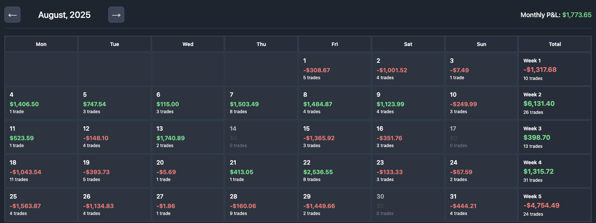

# Trading Calendar

A web-based calendar application to visualize your daily trading performance.



## How It Works

This app displays your trading data in a monthly calendar view with color-coded P&L values, trade counts, and weekly/monthly summaries.

## Setup

1. Install dependencies:
```bash
npm install
```

2. Add your trading data to `src/data/pnl_report.json` in this format:
```json
{
  "2025-06": {
    "month": "June",
    "year": 2025,
    "days": [
      {
        "date": "2025-06-01",
        "pnl": 250.5,
        "tradeCount": 3,
        "hasNotes": false
      }
    ]
  }
}
```

3. Run the app:
```bash
npm run serve
```

## Generating the Report

You can generate the `pnl_report.json` file from your Coinbase trading data using:

https://github.com/josepharder/coinbase-pnl-calculator
